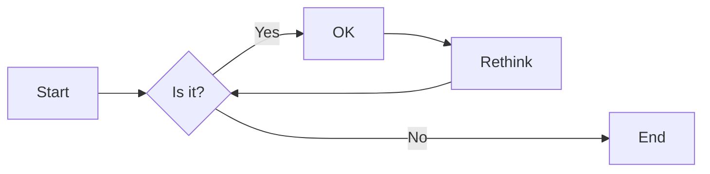
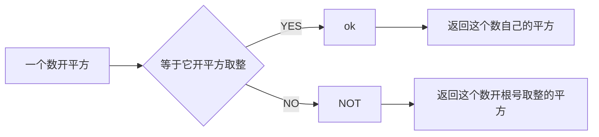
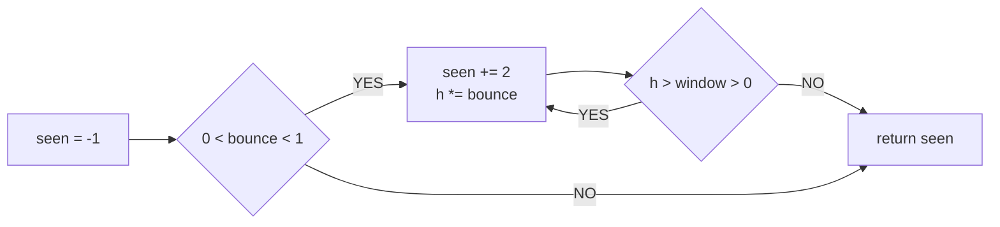
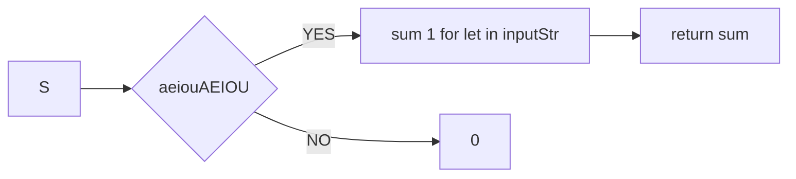
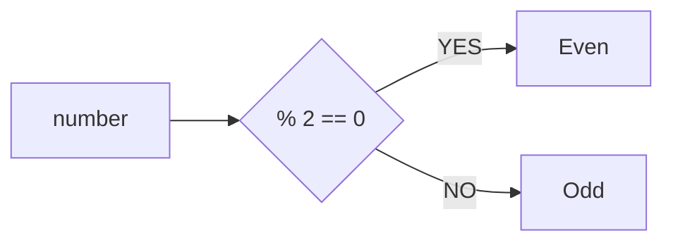

# 实验二 Python变量、简单数据类型

班级： 21计科1班

学号： B20210301117

姓名： 张靠

Github地址：<https://github.com/zhangkaoaizhongguo/zhangkao.git>

CodeWars地址：<https://www.codewars.com/users/zhangkao>

---

## 实验目的

1. 使用VSCode编写和运行Python程序
2. 学习Python变量和简单数据类型

## 实验环境

1. Git
2. Python 3.10
3. VSCode
4. VSCode插件

## 实验内容和步骤

### 第一部分

实验环境的安装

1. 安装Python，从Python官网下载Python 3.10安装包，下载后直接点击可以安装：[Python官网地址](https://www.python.org/downloads/)
2. 为了在VSCode集成环境下编写和运行Python程序，安装下列VScode插件
   - Python
   - Python Environment Manager
   - Python Indent
   - Python Extended
   - Python Docstring Generator
   - Jupyter
   - indent-rainbow
   - Jinja

---

### 第二部分

Python变量、简单数据类型和列表简介

完成教材《Python编程从入门到实践》下列章节的练习：

- 第2章 变量和简单数据类型

---

### 第三部分

在[Codewars网站](https://www.codewars.com)注册账号，完成下列Kata挑战：

---

#### 第1题：求离整数n最近的平方数（Find Nearest square number）

难度：8kyu

你的任务是找到一个正整数n的最近的平方数
例如，如果n=111，那么nearest_sq(n)（nearestSq(n)）等于121，因为111比100（10的平方）更接近121（11的平方）。
如果n已经是完全平方（例如n=144，n=81，等等），你需要直接返回n。
代码提交地址
<https://www.codewars.com/kata/5a805d8cafa10f8b930005ba>

---

#### 第2题：弹跳的球（Bouncing Balls）

难度：6kyu

一个孩子在一栋高楼的第N层玩球。这层楼离地面的高度h是已知的。他把球从窗口扔出去。球弹了起来,  例如:弹到其高度的三分之二（弹力为0.66）。他的母亲从离地面w米的窗户向外看,母亲会看到球在她的窗前经过多少次（包括球下落和反弹的时候）？

一个有效的实验必须满足三个条件：

- 参数 "h"（米）必须大于0
- 参数 "bounce "必须大于0且小于1
- 参数 “window "必须小于h。

如果以上三个条件都满足，返回一个正整数，否则返回-1。
**注意:只有当反弹球的高度严格大于窗口参数时，才能看到球。**
代码提交地址
<https://www.codewars.com/kata/5544c7a5cb454edb3c000047/train/python>

---

#### 第3题： 元音统计(Vowel Count)

难度： 7kyu

返回给定字符串中元音的数量（计数）。对于这个Kata，我们将考虑a、e、i、o、u作为元音（但不包括y）。输入的字符串将只由小写字母和/或空格组成。

代码提交地址：
<https://www.codewars.com/kata/54ff3102c1bad923760001f3>

---

#### 第4题：偶数或者奇数（Even or Odd）

难度：8kyu

创建一个函数接收一个整数作为参数，当整数为偶数时返回”Even”当整数位奇数时返回”Odd”。
代码提交地址：
<https://www.codewars.com/kata/53da3dbb4a5168369a0000fe>

### 第四部分

使用Mermaid绘制程序流程图

安装Mermaid的VSCode插件：

- Markdown Preview Mermaid Support
- Mermaid Markdown Syntax Highlighting

使用Markdown语法绘制你的程序绘制程序流程图（至少一个），Markdown代码如下：

## [程序流程图]

显示效果如下：



查看Mermaid流程图语法-->[点击这里](https://mermaid.js.org/syntax/flowchart.html)

使用Markdown编辑器（例如VScode）编写本次实验的实验报告，包括[实验过程与结果](#实验过程与结果)、[实验考查](#实验考查)和[实验总结](#实验总结)，并将其导出为 **PDF格式** 来提交。

## 实验过程与结果

请将实验过程与结果放在这里，包括：

- [第二部分 Python变量、简单数据类型和列表简介](#第二部分)
- [第三部分 Codewars Kata挑战](#第三部分)
- [第四部分 使用Mermaid绘制程序流程图](#第四部分)

注意代码需要使用markdown的代码块格式化，例如Git命令行语句应该使用下面的格式：

![Git命令]

显示效果如下：

```bash
git init
git add .
git status
git commit -m "first commit"
```

如果是Python代码，应该使用下面代码块格式，例如：

## [Python题目代码]

练习第一题显示效果如下：
Find Nearest square number

```python
def nearest_sq(n):
    return round(n ** 0.5) ** 2
```

练习第二题显示效果如下：
Bouncing Balls

```python
def bouncingBall(h, bounce, window):
    seen = -1
    
    if 0 < bounce < 1:
        while h > window > 0:
            seen += 2
            h *= bounce
    
    return seen
```

练习第三题显示效果如下：
Vowel Count

```python
def getCount(inputStr):
    return sum(1 for let in inputStr if let in "aeiouAEIOU")
```

练习第四题显示效果如下：Even or Odd

```python
def even_or_odd(number):
  if number % 2 == 0:
    return "Even"
  else:
    return "Odd"
```

代码运行结果的文本可以直接粘贴在这里。

## [流程图]

显示效果如下:
第一题Find Nearest square number(找到最近的平方数)



第二题Bouncing Balls(弹跳的小球)



第三题Vowel Count(元音统计)



第四题Even or Odd



**注意：不要使用截图，Markdown文档转换为Pdf格式后，截图可能会无法显示。**

## 实验考查

请使用自己的语言并使用尽量简短代码示例回答下面的问题，这些问题将在实验检查时用于提问和答辩以及实际的操作。

1. Python中的简单数据类型有那些？我们可以对这些数据类型做哪些操作？
2. 为什么说Python中的变量都是标签？
3. 有哪些方法可以提高Python代码的可读性？

## 我的解答

 1. Python中的数字类型包含整型、浮点型和复数类型。布尔类型是特殊的整型，它的值只有两个，分别是True和False。如果将布尔值进行数值运算，True会被当作整型1，False会被当作整型0。Python 中的字符串被定义为一个字符集合，它被引号所包含，引号可以是单引号、双引号或者三引号(三个连续的单引号或者双引号)。字符串具有索引规则，第1个字符的索引是0，第2个字符的索引是1，以此类推。我们可以将列表和元组当作是普通的“数组”，它们可以保存任意数量的任意类型的 值，这些值称作元素。列表中的元素使用中括号[]包含，元素的个数和值是可以随意修改的。而元组中的元素使用小括号()包含，元素不可以被修改。字典是Python中的映射数据类型，由键-值对组成。字典可以存储不同类型的元素，元素使用大括号{}来包含。通常情况下，字典的键会以字符串或者数值的形式来表示，而值可以是任意类型。
 2. Python 里的变量，与其说是装数据的容器，倒不如说是贴在数据上的标签。 变量并不占用空间，占用空间的是数据本身。 当你重新赋值时，就相当于撕下这个标签，贴纸另一个数据上。
 3. 1.代码布局缩进。标准Python风格中每个缩进级别使用4个空格，不推荐使用Tab，禁止混用空格与Tab。行的最大长度。每行最大长度79，换行可以使用反斜杠，但建议使用圆括号。空白行。顶层函数和定义的类之间空两行，类中的方法定义之间空一行；函数内逻辑无关的代码段之间空一行，其他地方尽量不要空行。2.空格的使用右括号前不要加空格。逗号、冒号分号前不要加空格。函数的左括号前不要加空格，如fun（1）。序列的左括号前不要加空格，如list[2]。操作符左右各加一个空格，如a+b=c。不要将多条语句写在同一行。if、for、while语句中,即使执行语句只有一句，也必须另起一行。3.代码注释块注释。块注释跟随被注释的代码，缩进至与代码相同的级别。块注释使用“#”开头。行内注释。行内注释是与代码语句同行的注释。行内注释与代码至少由两个空格分隔，注释以“#”开头。文档字符串。文档字符串指的是为所有公共模块、函数、类以及方法编写的文档说明。文档字符串使用三引号包裹4.命名规范不要使用字母“I”（L的小写）、“0”（大写0）、“I”（大写I）作为单字符变量名。模块名、包名应简短且全为小写。函数名应该小写，如果想提高可读性，可以用下画线分隔小写单词。类名首字母一般使用大写。常量通常采用全大写命名。

## 实验总结

这次实验主要是对Python中的数据类型和变量有了一个初步的认识，并且在此基础上尝试了对其进行应用，途中遇到了困难，在尝试写代码的时候主要的问题就是格式问题-代码块，对代码块的理解不够导致了在运行的时候出现了许多的问题，代码运行报错，代码运行成功但没有达到我所想要的结果。看来这还是需要我去练习来加深理解。在codewars练习的第一题中使用了round()这个函数，它的作用就是简单来说就是四舍五入的取整，这恰好与第一道练习的要求相符可以用来进行判断，结果正确。在第二个练习中使用了if和while语句，这里要明确与其对应的代码块，不然会频频报错，在第三题中就是用了sum()函数，同时使用了for循环和if语句的嵌套，这里要注意其严谨逻辑结构，这里也是一行搞定。这一次实验还有个不同的就是流程图了，流程图就是对代码的可视化，更容易看清楚代码的逻辑运转，画流程图我们这次引入了Mermaid来帮助画出流程图，第一次使用，当然会很麻烦不知道如何使用，但在通过对例子的依葫芦画瓢和同学的帮助下也浅浅学会了尝试画几张简图。总之，这次实验收获了很多，算法，编程思想，对函数的理解还有运用mermaid来画出流程图，方便我在今后的学习中使用和解决相应的问题。
