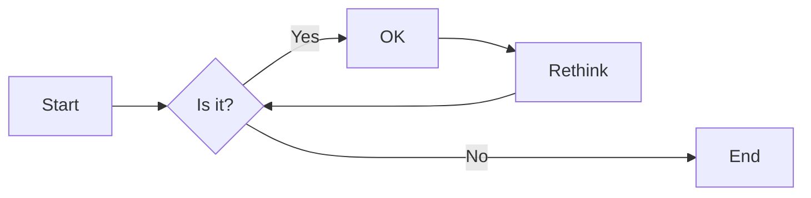
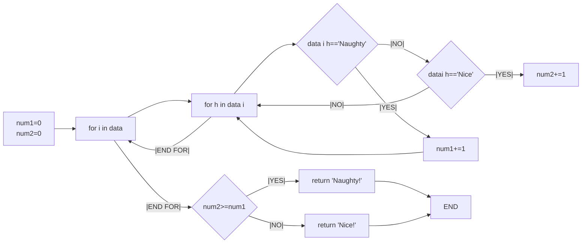
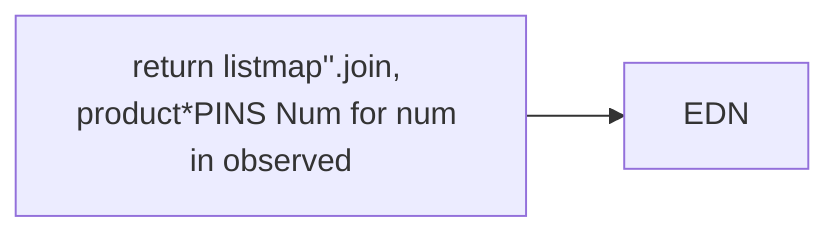
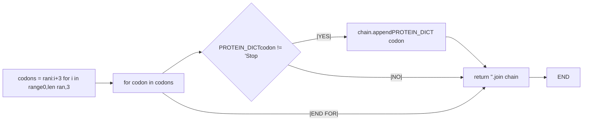
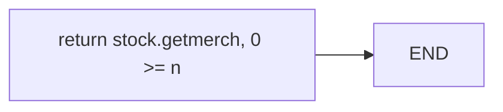
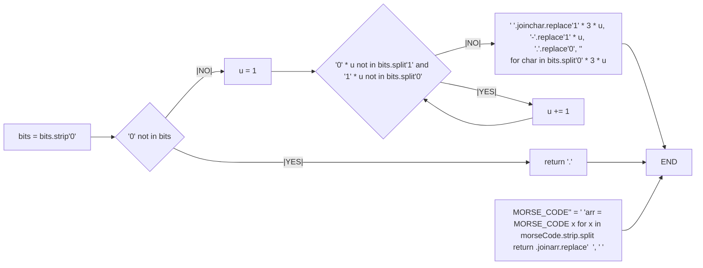

# 实验四 Python字典和while循环

班级： 21计科1

学号： B20210301117

姓名： 张靠

Github地址：<git@github.com:zhangkaoaizhongguo/zhangkao.git>

CodeWars地址：<https://www.codewars.com/users/zhangkao>

---

## 实验目的

1. 学习Python字典
2. 学习Python用户输入和while循环

## 实验环境

1. Git
2. Python 3.10
3. VSCode
4. VSCode插件

## 实验内容和步骤

### 第一部分

Python列表操作

完成教材《Python编程从入门到实践》下列章节的练习：

- 第6章 字典
- 第7章 用户输入和while循环

---

### 第二部分

在[Codewars网站](https://www.codewars.com)注册账号，完成下列Kata挑战：

---

#### 第一题：淘气还是乖孩子（Naughty or Nice）

难度： 7kyu

圣诞老人要来镇上了，他需要你帮助找出谁是淘气的或善良的。你将会得到一整年的JSON数据，按照这个格式：

```python
{
    January: {
        '1': 'Naughty','2': 'Naughty', ..., '31': 'Nice'
    },
    February: {
        '1': 'Nice','2': 'Naughty', ..., '28': 'Nice'
    },
    ...
    December: {
        '1': 'Nice','2': 'Nice', ..., '31': 'Naughty'
    }
}
def naughty_or_nice(data):
    num1=0
    num2=0
    for i in data:
        for h in data[i]:
            if data[i][h]=='Naughty':
                num1+=1
            elif data[i][h]=='Nice':
                num2+=1
    if num2>=num1:
        return 'Nice!'
    else:
        return 'Naughty!'
```

你的函数应该返回 "Naughty!"或 "Nice!"，这取决于在某一年发生的总次数（以较大者为准）。如果两者相等，则返回 "Nice！"。
代码提交地址：
<https://www.codewars.com/kata/5662b14e0a1fb8320a00005c>

---

#### 第二题： 观察到的PIN（The observed PIN）

难度：4kyu

好了，侦探，我们的一个同事成功地观察到了我们的目标人物，抢劫犯罗比。我们跟踪他到了一个秘密仓库，我们认为在那里可以找到所有被盗的东西。这个仓库的门被一个电子密码锁所保护。不幸的是，我们的间谍不确定他看到的密码，当罗比进入它时。

键盘的布局如下：

```python
┌───┬───┬───┐
│ 1 │ 2 │ 3 │
├───┼───┼───┤
│ 4 │ 5 │ 6 │
├───┼───┼───┤
│ 7 │ 8 │ 9 │
└───┼───┼───┘
    │ 0 │
    └───┘
```

他注意到密码1357，但他也说，他看到的每个数字都有可能是另一个相邻的数字（水平或垂直，但不是对角线）。例如，代替1的也可能是2或4。而不是5，也可能是2、4、6或8。

他还提到，他知道这种锁。你可以无限制地输入错误的密码，但它们最终不会锁定系统或发出警报。这就是为什么我们可以尝试所有可能的（*）变化。

*可能的意义是：观察到的PIN码本身和考虑到相邻数字的所有变化。

你能帮助我们找到所有这些变化吗？如果有一个函数，能够返回一个列表，其中包含一个长度为1到8位的观察到的PIN的所有变化，那就更好了。我们可以把这个函数命名为getPINs（在python中为get_pins，在C#中为GetPINs）。

但请注意，所有的PINs，包括观察到的PINs和结果，都必须是字符串，因为有可能会有领先的 "0"。我们已经为你准备了一些测试案例。
侦探，我们就靠你了!
代码提交地址：
<https://www.codewars.com/kata/5263c6999e0f40dee200059d>

---

#### 第三题： RNA到蛋白质序列的翻译（RNA to Protein Sequence Translation）

难度：6kyu

蛋白质是由DNA转录成RNA，然后转译成蛋白质的中心法则。RNA和DNA一样，是由糖骨架（在这种情况下是核糖）连接在一起的长链核酸。每个由三个碱基组成的片段被称为密码子。称为核糖体的分子机器将RNA密码子转译成氨基酸链，称为多肽链，然后将其折叠成蛋白质。

蛋白质序列可以像DNA和RNA一样很容易地可视化，作为大字符串。重要的是要注意，“停止”密码子不编码特定的氨基酸。它们的唯一功能是停止蛋白质的转译，因此它们不会被纳入多肽链中。“停止”密码子不应出现在最终的蛋白质序列中。为了节省您许多不必要（和乏味）的键入，已为您的氨基酸字典提供了键和值。

给定一个RNA字符串，创建一个将RNA转译为蛋白质序列的函数。注意：测试用例将始终生成有效的字符串。

```python
protein（'UGCGAUGAAUGGGCUCGCUCC'）
```

将返回`CDEWARS`

作为测试用例的一部分是一个真实世界的例子！最后一个示例测试用例对应着一种叫做绿色荧光蛋白的蛋白质，一旦被剪切到另一个生物体的基因组中，像GFP这样的蛋白质可以让生物学家可视化细胞过程！

Amino Acid Dictionary

```python
   # Your dictionary is provided as PROTEIN_DICT
   PROTEIN_DICT = {
    # Phenylalanine
    'UUC': 'F', 'UUU': 'F',
    # Leucine
    'UUA': 'L', 'UUG': 'L', 'CUU': 'L', 'CUC': 'L', 'CUA': 'L', 'CUG': 'L',
    # Isoleucine
    'AUU': 'I', 'AUC': 'I', 'AUA': 'I',
    # Methionine
    'AUG': 'M',
    # Valine
    'GUU': 'V', 'GUC': 'V', 'GUA': 'V', 'GUG': 'V',
    # Serine
    'UCU': 'S', 'UCC': 'S', 'UCA': 'S', 'UCG': 'S', 'AGU': 'S', 'AGC': 'S',
    # Proline
    'CCU': 'P', 'CCC': 'P', 'CCA': 'P', 'CCG': 'P',
    # Threonine
    'ACU': 'T', 'ACC': 'T', 'ACA': 'T', 'ACG': 'T',
    # Alanine
    'GCU': 'A', 'GCC': 'A', 'GCA': 'A', 'GCG': 'A',
    # Tyrosine
    'UAU': 'Y', 'UAC': 'Y',
    # Histidine
    'CAU': 'H', 'CAC': 'H',
    # Glutamine
    'CAA': 'Q', 'CAG': 'Q',
    # Asparagine
    'AAU': 'N', 'AAC': 'N',
    # Lysine
    'AAA': 'K', 'AAG': 'K',
    # Aspartic Acid
    'GAU': 'D', 'GAC': 'D',
    # Glutamic Acid
    'GAA': 'E', 'GAG': 'E',
    # Cystine
    'UGU': 'C', 'UGC': 'C',
    # Tryptophan
    'UGG': 'W',
    # Arginine
    'CGU': 'R', 'CGC': 'R', 'CGA': 'R', 'CGG': 'R', 'AGA': 'R', 'AGG': 'R',
    # Glycine
    'GGU': 'G', 'GGC': 'G', 'GGA': 'G', 'GGG': 'G',
    # Stop codon
    'UAA': 'Stop', 'UGA': 'Stop', 'UAG': 'Stop'
}
def protein(ran):
    # your code here
    codons = [ran[i:i+3] for i in range(0,len(ran),3)]
    chain = []
    for codon in codons:
        if PROTEIN_DICT[codon] != 'Stop':
            chain.append(PROTEIN_DICT[codon])
        else:
            break
    return ''.join(chain)
```

代码提交地址：
<https://www.codewars.com/kata/555a03f259e2d1788c000077>

---

#### 第四题： 填写订单（Thinkful - Dictionary drills: Order filler）

难度：8kyu

您正在经营一家在线业务，您的一天中很大一部分时间都在处理订单。随着您的销量增加，这项工作占用了更多的时间，不幸的是最近您遇到了一个情况，您接受了一个订单，但无法履行。

您决定写一个名为`fillable()`的函数，它接受三个参数：一个表示您库存的字典`stock`，一个表示客户想要购买的商品的字符串`merch`，以及一个表示他们想购买的商品数量的整数n。如果您有足够的商品库存来完成销售，则函数应返回`True`，否则应返回`False`。

有效的数据将始终被传入，并且n将始终大于等于1。

代码提交地址：
<https://www.codewars.com/kata/586ee462d0982081bf001f07/python>

---

```python
def fillable(stock, merch, n):
  return stock.get(merch, 0) >= n
```

#### 第五题： 莫尔斯码解码器（Decode the Morse code, advanced）

难度： 4kyu

在这个作业中，你需要为有线电报编写一个莫尔斯码解码器。
有线电报通过一个有按键的双线路运行，当按下按键时，会连接线路，可以在远程站点上检测到。莫尔斯码将每个字符的传输编码为"点"（按下按键的短按）和"划"（按下按键的长按）的序列。

在传输莫尔斯码时，国际标准规定：

- "点" - 1个时间单位长。
- "划" - 3个时间单位长。
- 字符内点和划之间的暂停 - 1个时间单位长。
- 单词内字符之间的暂停 - 3个时间单位长。
- 单词间的暂停 - 7个时间单位长。

但是，该标准没有规定"时间单位"有多长。实际上，不同的操作员会以不同的速度进行传输。一个业余人士可能需要几秒钟才能传输一个字符，一位熟练的专业人士可以每分钟传输60个单词，而机器人发射器可能会快得多。

在这个作业中，我们假设消息的接收是由硬件自动执行的，硬件会定期检查线路，如果线路连接（远程站点的按键按下），则记录为1，如果线路未连接（远程按键弹起），则记录为0。消息完全接收后，它会以一个只包含0和1的字符串的形式传递给你进行解码。

例如，消息`HEY JUDE`，即`···· · −·−−   ·−−− ··− −·· ·`可以如下接收：

```python
1100110011001100000011000000111111001100111111001111110000000000000011001111110011111100111111000000110011001111110000001111110011001100000011
```

如您所见，根据标准，这个传输完全准确，硬件每个"点"采样了两次。

因此，你的任务是实现两个函数：

函数decodeBits(bits)，应该找出消息的传输速率，正确解码消息为点（.）、划（-）和空格（字符之间有一个空格，单词之间有三个空格），并将它们作为一个字符串返回。请注意，在消息的开头和结尾可能会出现一些额外的0，确保忽略它们。另外，如果你无法分辨特定的1序列是点还是划，请假设它是一个点。

函数decodeMorse(morseCode)，它将接收上一个函数的输出，并返回一个可读的字符串。

注意：出于编码目的，你必须使用ASCII字符.和-，而不是Unicode字符。

莫尔斯码表已经预加载给你了（请查看解决方案设置，以获取在你的语言中使用它的标识符）。

```python
morseCodes(".--")  #to access the morse translation of ".--"
```

下面是Morse码支持的完整字符列表：

```javascript
A    ·–
B    –···
C    –·–·
D    –··
E    ·
F    ··–·
G    ––·
H    ····
I    ··
J    ·–––
K    –·–
L    ·–··
M    ––
N    –·
O    –––
P    ·––·
Q    ––·–
R    ·–·
S    ···
T    –
U    ··–
V    ···–
W    ·––
X    –··–
Y    –·––
Z    ––··
0    –––––
1    ·––––
2    ··–––
3    ···––
4    ····–
5    ·····
6    –····
7    ––···
8    –––··
9    ––––·
.    ·–·–·–
,    ––··––
?    ··––··
'    ·––––·
!    –·–·––
/    –··–·
(    –·––·
)    –·––·–
&    ·–···
:    –––···
;    –·–·–·
=    –···–
+    ·–·–·
-    –····–
_    ··––·–
"    ·–··–·
$    ···–··–
@    ·––·–·
```

代码提交地址：
<https://www.codewars.com/kata/decode-the-morse-code-advanced>

---

### 第三部分

使用Mermaid绘制程序流程图

安装VSCode插件：

- Markdown Preview Mermaid Support
- Mermaid Markdown Syntax Highlighting

使用Markdown语法绘制你的程序绘制程序流程图（至少一个），Markdown代码如下：


显示效果如下：



查看Mermaid流程图语法-->[点击这里](https://mermaid.js.org/syntax/flowchart.html)

使用Markdown编辑器（例如VScode）编写本次实验的实验报告，包括[实验过程与结果](#实验过程与结果)、[实验考查](#实验考查)和[实验总结](#实验总结)，并将其导出为 **PDF格式** 来提交。

## 实验过程与结果

请将实验过程与结果放在这里，包括：

- [第一部分 Python列表操作和if语句](#第一部分)
- [第二部分 Codewars Kata挑战](#第二部分)
- [第三部分 使用Mermaid绘制程序流程图](#第三部分)

注意代码需要使用markdown的代码块格式化，例如Git命令行语句应该使用下面的格式：


显示效果如下：

```bash
git init
git add .
git status
git commit -m "first commit"
```

如果是Python代码，应该使用下面代码块格式，例如：


显示效果如下：

```python
def add_binary(a,b):
    return bin(a+b)[2:]
```

代码运行结果的文本可以直接粘贴在这里。

## 第一部分  Python列表操作和if语句

1. 简单替换for循环
它的主要语法结构如下：
my_list=[ 表达式 for 循环项 in 循环体 (if 条件) ]
这里表达式可以为循环项，也可以为循环项的函数或者方法，下面看给例子：

```python
name = "Donald Trump"
 
#list内的for循环语法,只使用一句代码
my_list = [c for c in name]
 
print(name)
print(my_list)
```

传统的for 循环语法是这么写的：

```python
name = "Donald Trump"
#传统for循环语法,需要使用三句代码
my_list=[]
for c in name:
    my_list.append(c)
print(name)   
print(my_list)
```

在这里传统的for循环需要使用三句代码, 而list内的for循环只使用了一句代码实现了同样的功能，我们再看一个例子：

```python
array = [[16, 3, 7],
          [2, 24, 9],
          [4, 1, 12]]
 
#表达式可以为循环项的函数
row_min = [min(row) for row in array ]
 
print(row_min)

```

上面代码的作用是找出二维数组array(其实是list内嵌list)每一行的最小值，同样也只使用了一句代码。上面代码的作用是找出二维数组array(其实是list内嵌list)每一行的最小值，同样也只使用了一句代码。

2.在list内的循环中使用if 条件

```python
names_list = ["Washington", "Trump", "Obama", "bush", "Clinton", "Reagan"]
l1 = [name for name in names_list if name.startswith('W')]
l2 = [name for name in names_list if name.startswith('W') or len(name) < 5]
l3 = [name for name in names_list if len(name) < 5 and name.islower()]
print(l1, l2, l3)
```

我们发现在list循环中也可以很方便的使用if条件 这里我们在for循环的尾部使用了if条件语句，如果换成传统的for循环语法可能又要增加许多行业代码了。

3.使用更加复杂的表达式

```python
names_list = ["washington", "trump", "obama", "bush", "clinton", "reagan"]
 
#将人名首字母大写
new_names = [name.capitalize() for name in names_list]
 
print(new_names)
```

这里我们list内的表达式使用了循环项name的方法capitalize(), 我们再看一个例子：

my_list=[ 表达式(if...else 条件) for 循环项 in 循环体 ]

```python
names_list = ["Washington", "Trump", "Obama", "bush", "Clinton", "Reagan"]
 
#在表达式中使用if条件
new_names = [name if name.startswith('T') else 'Not President' for name in names_list]
 
print(new_names)
```

之前我们是在for循环的尾部添加if 条件，不过我们也可以在表达式中使用if条件语句。这里需要指出的是表达式内的if条件语句中必须要同时使用else语句，这和之前在for循环尾部添加if条件有所不同，这是因为在表达式内的if语句必须遵循给变量赋值的python语法如：

```python
a = 1
b = 2 if a>0 # 语法错误
 
b = 2 if a > 0 else -1  
```

4.使用嵌套for循环语法
可以在list内使用嵌套for循环语法，下面我们看一个例子：

```python
names_list = ["Trump", "Obama","Clinton"]
 
#双重for循环
chars = [c for name in names_list for c in name]
 
print(chars)
```

下面是传统的两层for循环语句：

```python
names_list = ["Trump", "Obama","Clinton"]
 
#传统的双层for循环,需要使用4句代码
chars = []
for name in names_list:
    for c in name:
        chars.append(c)
        
print(chars)
```

我们看到传统的双层嵌套for循环需要使用4句代码，而list内的双层for循环只使用了一句代码。当然传统代码的可读性要比要比list内循环语句更好一些，因此也不太建议在list内加入太多的for循环，这样会使代码的可读性变差。另外我们还可以在两层for循环的中间使用if条件：

```python
names_list = ["Trump", "Obama","bush"]
 
#可以在两层for循环的中间使用if条件
chars = [char for name in names_list if len(name) < 5 for char in name]
 
print(chars)
```

5.尽量避免使用map(),filter()这样的内置函数
python有一些内置函数如map()、filter(),这些内置函数使用简单，但是存在可读性差，不容易理解的缺点，一个良好的习惯是尽量使用list内的for循环来代替这些内置函数， 就连python的作者都建议这样做。
map()函数可以这样替换：
map函数
L = map(func, 循环体)
替换为:
L = [func(a) for a in 循环体]

```python
array = [[16, 3, 7],
          [2, 24, 9],
          [4, 1, 12]]
 
row_min = map(min, array)
print(list(row_min))
 
#替换为
row_min = [min(row) for row in array ]
print(row_min)
```

filter()函数可以替换为:
filter函数
L = filter(condition_func, 循环体)
替换为
L = [a for a in 循环体 if 条件]

```python
names_list = ["Trump", "Obama","bush"]
 
#filter函数
L1 = filter(lambda name: len(name) < 5, names_list)
print(list(L1))
 
#替换为：
L2 = [name for name in names_list if len(name) < 5]
print(L2)
```

6.尽量使用生成器(Generator)变量来减少内存开销
在python中定义一个list变量时，一般会给这个list变量立即分配内存,这种在定义变量时立即分配内存的方式会增加系统的内存开销，而一种高效的方法是只在定义变量时并不立即分配实际内存,只在真正使用变量时才会分配内存，这就是我们的Generator变量，在定义Generator变量时只要将原来list的方括号替换成圆括号即可：

```python
#list变量,立即分配实际内存
L1 = [x for x in range(1_000_000)]
 
#Generator变量,不分配实际内存
L2 = (x for x in range(1_000_000))
print(L1.__sizeof__())
print(L2.__sizeof__())

#list变量
L1 = [ w for w in range(10)]
for i in L1:
    print(i)
 
#替换为生成器变量
L2 = (w for w in range(10))
for i in L2:
    print(i)
```

## 第二部分 Codewars Kata挑战代码如下

第一题：淘气还是乖孩子（Naughty or Nice）

```python
{
    January: {
        '1': 'Naughty','2': 'Naughty', ..., '31': 'Nice'
    },
    February: {
        '1': 'Nice','2': 'Naughty', ..., '28': 'Nice'
    },
    ...
    December: {
        '1': 'Nice','2': 'Nice', ..., '31': 'Naughty'
    }
}
def naughty_or_nice(data):
    num1=0
    num2=0
    for i in data:
        for h in data[i]:
            if data[i][h]=='Naughty':
                num1+=1
            elif data[i][h]=='Nice':
                num2+=1
    if num2>=num1:
        return 'Nice!'
    else:
        return 'Naughty!'
```

第二题：观察到的PIN（The observed PIN）

```python
from itertools import product

PINS = {'1': '124', '2': '1253', '3': '236', '4': '1457', '5': '24568',
        '6': '3569', '7': '478', '8': '57890', '9': '689', '0': '08'}


def get_pins(observed):
    return list(map(''.join, product(*[PINS[num] for num in observed])))
```

第三题：RNA到蛋白质序列的翻译（RNA to Protein Sequence Translation）

```python
def protein(ran):
    # your code here
    codons = [ran[i:i+3] for i in range(0,len(ran),3)]
    chain = []
    for codon in codons:
        if PROTEIN_DICT[codon] != 'Stop':
            chain.append(PROTEIN_DICT[codon])
        else:
            break
    return ''.join(chain)
```

第四题：填写订单（Thinkful - Dictionary drills: Order filler）

```python
def fillable(stock, merch, n):
  return stock.get(merch, 0) >= n
```

第五题：莫尔斯码解码器（Decode the Morse code, advanced）

```python
def decodeBits(bits):
    bits = bits.strip('0')
    if '0' not in bits:
        return '.'
    u = 1
    while ('0' * u) not in bits.split('1') and ('1' * u) not in bits.split('0'):
        u += 1
    return ' '.join([char.replace('1' * 3 * u, '-').replace('1' * u, '.').replace('0', '')
                     for char in bits.split('0' * 3 * u)])

def decodeMorse(morseCode):
    MORSE_CODE[''] = ' '
    arr = [MORSE_CODE[x] for x in morseCode.strip().split(' ')]
    return "".join(arr).replace('  ', ' ')

```

## 第三部分 使用Mermaid绘制程序流程图

第一题：淘气还是乖孩子（Naughty or Nice）



第二题：观察到的PIN（The observed PIN）



第三题：RNA到蛋白质序列的翻译（RNA to Protein Sequence Translation）



第四题：填写订单（Thinkful - Dictionary drills: Order filler）



第五题：莫尔斯码解码器（Decode the Morse code, advanced）



**注意：不要使用截图，Markdown文档转换为Pdf格式后，截图可能会无法显示。**

## 实验考查

请使用自己的语言并使用尽量简短代码示例回答下面的问题，这些问题将在实验检查时用于提问和答辩以及实际的操作。

1. 字典的键和值有什么区别？
答：字典是“键-值对“的无序可变序列，字典中每个元素都包含两部分：“键”和“值”。定义字典时，每个元素的“键”和“值”用冒号分隔，相邻元素之间用逗号分隔，所有元素放在一对大括号({})内。字典中的键可以是python中任意不可变数据：整数，实数，复数，字符串，元组，不可使用列表、集合和字典。键不允许重复。

2. 在读取和写入字典时，需要使用默认值可以使用什么方法？

答：在python 中 get()以及setdefault() 都可以达到默认值的作用

3. Python中的while循环和for循环有什么区别？

答：Python中while和for循环的区别在于，while循环是在满足条件的情况下一直执行，而for循环则是在给定的序列中循环执行。while循环需要手动控制循环的终止条件，而for循环则会自动遍历序列中的每个元素。在一些情况下，for循环更加简洁和易于使用，而在需要更加灵活的循环条件时，while循环则更加适合。

4. 阅读[PEP 636 – Structural Pattern Matching: Tutorial](https://peps.python.org/pep-0636/), 总结Python 3.10中新出现的match语句的使用方法。

答：对于一种可能性、两种可能性或者多种可能性的情况，可以通过if语句来实现。而用if语句实现多种可能性时，需要用到多个elif语句，这样代码看上去比较混乱，也可以通过match语句来实现多种可能性，并且代码看上去要整洁的多。
match语句的语法如下所示：

```python
match 变量/表达式:
 
  case 值1:
 
     语句1
 
  case 值2:
 
     语句2
 
  case 值3:
 
     语句3
 
  ...
 
  case _：
 
     语句n
```

其中，match之后跟的是变量或者表达式，而case后面是该变量或者表达式的可能取值，当其值是值1时，则执行语句1，当其值是值2时，则执行语句2，以此类推。如果该变量或者表达式的取值没有在case语句所指定的值中，则执“case _”后的语句n。match语句根据变量i的不同值，将执行不同语句。
match语句的注意事项：
在使用match语句时，需要注意以下两点，
(1)注意使用冒号
在match语句和case语句之后，都要有冒号。
(2)注意使用缩进
在match语句和case语句之后的代码，都要有缩进。

## 实验总结

总结一下这次实验你学习和使用到的知识，例如：编程工具的使用、数据结构、程序语言的语法、算法、编程技巧、编程思想。在list中使用for循环，可以是代码变的简洁优雅，同时也不应增加过多的list内的for循环层数，这样会使程序的可读性变差。我们应尽量使用list的for循环来代替如map和filter等内置函数，因为这些内置函数也会使程序的可读性变差。最后我们应尽量使用生成器变量(Generator),因为它可以减少内存开销。对比for循环和while循环，我们不难发现，两者在使用else上有很大区别，如果else语句和while循环语句一起使用，则当条件变成False时，就执行else语句。如果else语句和for循环语句一起使用，else语句块只在for循环正常终止时执行。另外for循环和while循环的循环次数有很大的不同。前者是取决于数据包含的元素个数，后者是却取决于条件何时为False。而在循环取值方面，for循环比while循环要强大，所以如果遇到循环取值的场景，就应该用for循环。但是另一方面，for循环只能对某种事物的集合做循环，而while可以进行任何种类的循环。但是，while循环很容易出错，大部分情况for循环也是一个很好的选择。