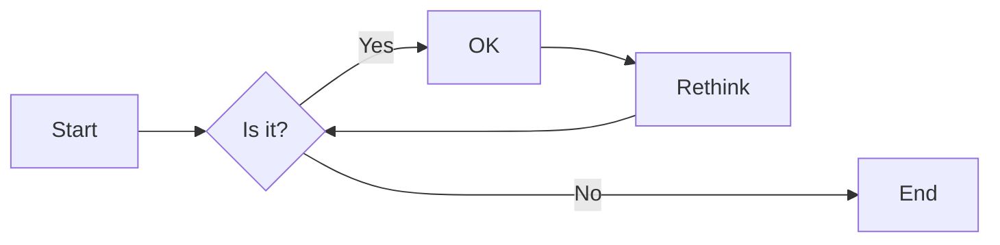
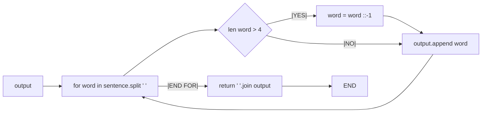
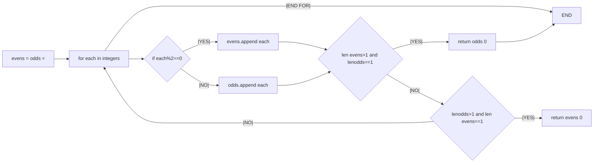
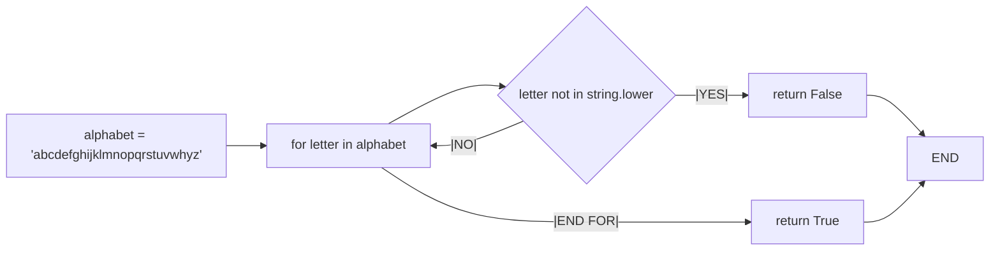
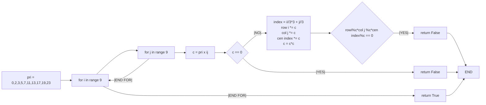
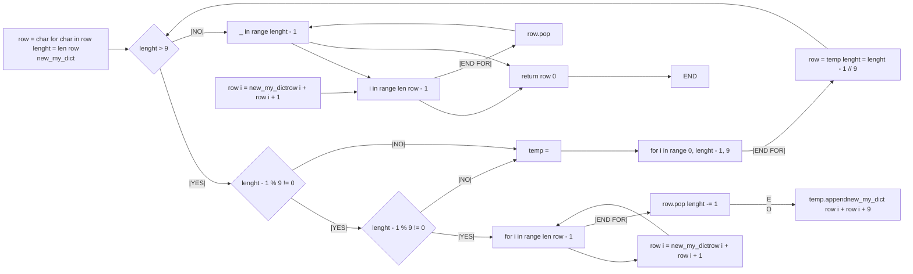

# 实验五 Python数据结构与数据模型

班级： 21计科1

学号：B2021301117

姓名： 张靠

Github地址：<git@github.com:zhangkaoaizhongguo/zhangkao.git>

CodeWars地址：<https://www.codewars.com/users/master%20Link>

---

## 实验目的

1. 学习Python数据结构的高级用法
2. 学习Python的数据模型

## 实验环境

1. Git
2. Python 3.10
3. VSCode
4. VSCode插件

## 实验内容和步骤

### 第一部分

在[Codewars网站](https://www.codewars.com)注册账号，完成下列Kata挑战：

---

#### 第一题：停止逆转我的单词

难度： 6kyu

编写一个函数，接收一个或多个单词的字符串，并返回相同的字符串，但所有5个或更多的字母单词都是相反的（就像这个Kata的名字一样）。传入的字符串将只由字母和空格组成。只有当出现一个以上的单词时，才会包括空格。
例如：

```python
spinWords( "Hey fellow warriors" ) => returns "Hey wollef sroirraw" 
spinWords( "This is a test") => returns "This is a test" 
spinWords( "This is another test" )=> returns "This is rehtona test"
```

代码提交地址：
<https://www.codewars.com/kata/5264d2b162488dc400000001>

提示：

- 利用str的split方法可以将字符串分为单词列表
例如：

```python
words = "hey fellow warrior".split()
# words should be ['hey', 'fellow', 'warrior']
```

- 利用列表推导将长度大于等于5的单词反转(利用切片word[::-1])
- 最后使用str的join方法连结列表中的单词。

---

#### 第二题： 发现离群的数(Find The Parity Outlier)

难度：6kyu

给你一个包含整数的数组（其长度至少为3，但可能非常大）。该数组要么完全由奇数组成，要么完全由偶数组成，除了一个整数N。请写一个方法，以该数组为参数，返回这个 "离群 "的N。

例如：

```python
[2, 4, 0, 100, 4, 11, 2602, 36]
# Should return: 11 (the only odd number)

[160, 3, 1719, 19, 11, 13, -21]
# Should return: 160 (the only even number)
```

代码提交地址：
<https://www.codewars.com/kata/5526fc09a1bbd946250002dc>

---

#### 第三题： 检测Pangram

难度：6kyu

pangram是一个至少包含每个字母一次的句子。例如，"The quick brown fox jumps over the lazy dog "这个句子就是一个pangram，因为它至少使用了一次字母A-Z（大小写不相关）。

给定一个字符串，检测它是否是一个pangram。如果是则返回`True`，如果不是则返回`False`。忽略数字和标点符号。
代码提交地址：
<https://www.codewars.com/kata/545cedaa9943f7fe7b000048>

---

#### 第四题： 数独解决方案验证

难度：6kyu

数独背景

数独是一种在 9x9 网格上进行的游戏。游戏的目标是用 1 到 9 的数字填充网格的所有单元格，以便每一列、每一行和九个 3x3 子网格（也称为块）中的都包含数字 1 到 9。更多信息请访问：<http://en.wikipedia.org/wiki/Sudoku>

编写一个函数接受一个代表数独板的二维数组，如果它是一个有效的解决方案则返回 true，否则返回 false。数独板的单元格也可能包含 0，这将代表空单元格。包含一个或多个零的棋盘被认为是无效的解决方案。棋盘总是 9 x 9 格，每个格只包含 0 到 9 之间的整数。

代码提交地址：
<https://www.codewars.com/kata/63d1bac72de941033dbf87ae>

---

#### 第五题： 疯狂的彩色三角形

难度： 2kyu

一个彩色的三角形是由一排颜色组成的，每一排都是红色、绿色或蓝色。连续的几行，每一行都比上一行少一种颜色，是通过考虑前一行中的两个相接触的颜色而产生的。如果这些颜色是相同的，那么新的一行就使用相同的颜色。如果它们不同，则在新的一行中使用缺失的颜色。这个过程一直持续到最后一行，只有一种颜色被生成。

例如：

```python
Colour here:            G G        B G        R G        B R
Becomes colour here:     G          R          B          G
```

一个更大的三角形例子：

```python
R R G B R G B B
 R B R G B R B
  G G B R G G
   G R G B G
    B B R R
     B G R
      R B
       G
```

你将得到三角形的第一行字符串，你的工作是返回最后的颜色，这将出现在最下面一行的字符串。在上面的例子中，你将得到 "RRGBRGBB"，你应该返回 "G"。
限制条件： 1 <= length(row) <= 10 ** 5
输入的字符串将只包含大写字母'B'、'G'或'R'。

例如：

```python
triangle('B') == 'B'
triangle('GB') == 'R'
triangle('RRR') == 'R'
triangle('RGBG') == 'B'
triangle('RBRGBRB') == 'G'
triangle('RBRGBRBGGRRRBGBBBGG') == 'G'
```

代码提交地址：
<https://www.codewars.com/kata/5a331ea7ee1aae8f24000175>

提示：请参考下面的链接，利用三进制的特点来进行计算。
<https://stackoverflow.com/questions/53585022/three-colors-triangles>

---

### 第二部分

使用Mermaid绘制程序流程图

安装VSCode插件：

- Markdown Preview Mermaid Support
- Mermaid Markdown Syntax Highlighting

使用Markdown语法绘制你的程序绘制程序流程图（至少一个），Markdown代码如下：


显示效果如下：



查看Mermaid流程图语法-->[点击这里](https://mermaid.js.org/syntax/flowchart.html)

使用Markdown编辑器（例如VScode）编写本次实验的实验报告，包括[实验过程与结果](#实验过程与结果)、[实验考查](#实验考查)和[实验总结](#实验总结)，并将其导出为 **PDF格式** 来提交。

## 实验过程与结果

请将实验过程与结果放在这里，包括：

- [第一部分 Codewars Kata挑战](#第一部分)
- [第二部分 使用Mermaid绘制程序流程图](#第二部分)

注意代码需要使用markdown的代码块格式化，例如Git命令行语句应该使用下面的格式：


显示效果如下：

```bash
git init
git add .
git status
git commit -m "first commit"
```

如果是Python代码，应该使用下面代码块格式，例如：


显示效果如下：

```python
def add_binary(a,b):
    return bin(a+b)[2:]
```

代码运行结果的文本可以直接粘贴在这里。

## 第一部分 Codewars Kata挑战

第一题：停止逆转我的单词

```python
def spin_words(sentence):
    output = []
    for word in sentence.split(' '):
        if len(word) > 4:
            word = word[::-1]
        output.append(word)
    return ' '.join(output)

```

第二题： 发现离群的数(Find The Parity Outlier)

```python
def find_outlier(integers):
 evens = []
 odds = []
for each in integers:
if each%2==0:
evens.append(each)
else:
odds.append(each)
if len(evens)>1 and len(odds)==1:
return odds[0]
elif len(odds)>1 and len(evens)==1:
return evens[0]
```

第三题： 检测Pangram

```python
import string

def is_pangram(string):
    alphabet = 'abcdefghijklmnopqrstuvwhyz'   
    for letter in alphabet:
        if letter not in string.lower():
            return False
    return True
```

第四题： 数独解决方案验证 (Sudoku board validator)

```python
def validate_sudoku(x):
    pri = [0,2,3,5,7,11,13,17,19,23]
    row = [1]*9
    col = [1]*9
    cen = [1]*9
    for i in range(9):
        for j in range(9):
            c = pri[x[i][j]]
            if c == 0:
                return False
            index = (i//3)*3 + j//3
            row[i] *= c
            col[j] *= c
            cen[index] *= c
            c = c*c
            if (row[i]%c)*(col[j]%c)*(cen[index]%c) == 0:
                return False
    return True
```

第五题： 疯狂的彩色三角形

```python
def triangle(row):
    row = [char for char in row]
    lenght = len(row)
    new_my_dict = {"RR": "R", "BB": "B", "GG": "G", "RG": "B", "GR": "B", "RB": "G", "BR": "G", "BG": "R", "GB": "R"}
    while lenght > 9:
        if (lenght - 1) % 9 != 0:
            while (lenght - 1) % 9 != 0:
                for i in range(len(row) - 1):
                row[i] = new_my_dict[row[i] + row[i + 1]]
                row.pop()
                lenght -= 1
                temp = []
            for i in range(0, lenght - 1, 9):
            temp.append(new_my_dict[row[i] + row[i + 9]])
        row = temp
        lenght = (lenght - 1) // 9       
    for _ in range(lenght - 1):
        for i in range(len(row) - 1): row[i] = new_my_dict[row[i] + row[i + 1]]
           row.pop()
    return row[0]
```

## 第二部分 使用Mermaid绘制程序流程图

第一题：停止逆转我的单词



第二题：发现离群的数(Find The Parity Outlier)



第三题：检测Pangram



第四题：数独解决方案验证 



第五题：疯狂的彩色三角形



**注意：不要使用截图，因为Markdown文档转换为Pdf格式后，截图会无法显示。**

## 实验考查

请使用自己的语言并使用尽量简短代码示例回答下面的问题，这些问题将在实验检查时用于提问和答辩以及实际的操作。

1. 集合（set）类型有什么特点？它和列表（list）类型有什么区别？

    答：集合（set）类型是一种无序的、不重复的数据结构，它的特点是：
        集合中的元素是唯一的，不会重复出现。
        集合中的元素是无序的，不能通过下标来访问集合中的元素。
        列表（list）类型是一种有序的、可重复的数据结构，它的特点是：
        列表中的元素是有序的，可以通过下标来访问列表中的元素。
        列表中的元素是可重复的，同一个元素可以出现多次。
        因此，集合和列表在存储数据和访问数据的方式上有很大的区别。

2. 集合（set）类型主要有那些操作？

    答：1.初始化一个集合：可以使用{}或者set()函数来初始化一个集合。
        2.集合的运算操作：包括并集（|）、交集（&）、差集（-）和对称差集（^）。
        3.集合的基本方法：包括add()、remove()、discard()、pop()、clear()等方法。
        4.集合的比较操作：包括issubset()、issuperset()、isdisjoint()等方法。
        5.集合的其他操作：包括len()、in、not in等操作。

3. 使用`*`操作符作用到列表上会产生什么效果？为什么不能使用`*`操作符作用到嵌套的列表上？使用简单的代码示例说明。
 
     答：使用*操作符作用到列表上会将列表中的元素解包，变成函数参数传递给函数。例如，可以使用*操作符将列表中的元素传递给函数作为位置参数，或者将字典中的键传递给函数作为关键字参数。但是，不能使用*操作符作用到嵌套的列表上，因为这样会导致解包出来的元素无法正确地传递给函数。
        以下是一个简单的代码示例：

 ```python
            # 使用 * 操作符将列表中的元素传递给函数
        def my_func(a, b, c):
            print(a, b, c)

        my_list = [1, 2, 3]
        my_func(*my_list)  # 输出：1 2 3

            # 不能使用 * 操作符将嵌套的列表传递给函数
        nested_list = [[1, 2], [3, 4]]
        my_func(*nested_list)  # 报错：TypeError: my_func() takes 3 positional arguments but 4 were given
```

5. 总结列表,集合，字典的解析（comprehension）的使用方法。使用简单的代码示例说明。
   
   答：列表解析（List Comprehension）是一种简洁的创建列表的方法，它可以通过一个表达式和一个可迭代对象来创建一个新的列表。下面是一个简单的示例代码：

```python
         # 创建一个包含1到10的平方数的列表
         squares = [x**2 for x in range(1, 11)]
         print(squares)
```

输出结果为：[1, 4, 9, 16, 25, 36, 49, 64, 81, 100]
集合解析（Set Comprehension）与列表解析类似，只不过它创建的是一个集合。下面是一个简单的示例代码：

```python
      # 创建一个包含1到10的平方数的集合
        squares_set = {x**2 for x in range(1, 11)}
        print(squares_set)
```

输出结果为：{64, 1, 4, 36, 100, 9, 16, 49, 81, 25}
字典解析（Dictionary Comprehension）是一种创建字典的方法，它可以通过一个表达式和一个可迭代对象来创建一个新的字典。下面是一个简单的示例代码：

```python
      # 创建一个包含1到10的平方数的字典
        squares_dict = {x: x**2 for x in range(1, 11)}
        print(squares_dict)
```

输出结果为：{1: 1, 2: 4, 3: 9, 4: 16, 5: 25, 6: 36, 7: 49, 8: 64, 9: 81, 10: 100}

## 实验总结

这次学习了python中的数据结构和数据模型，学会了使用集合和列表，也明白了集合和列表之间的区别，集合中的元素是唯一的，不会重复出现。 集合中的元素是无序的，不能通过下标来访问集合中的元素。