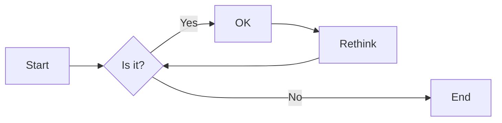
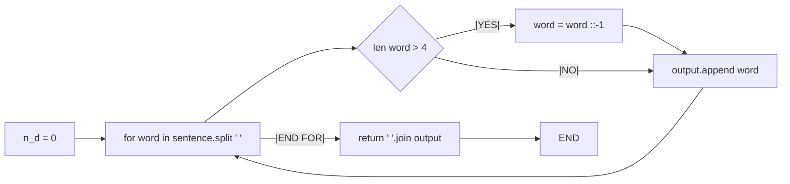
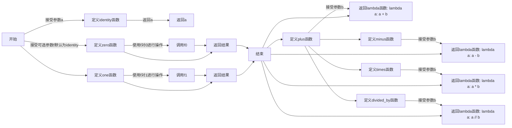
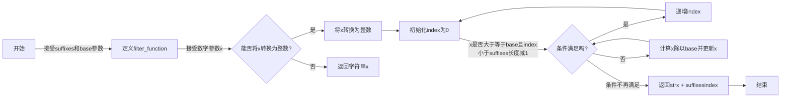
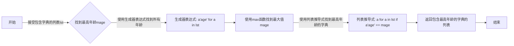
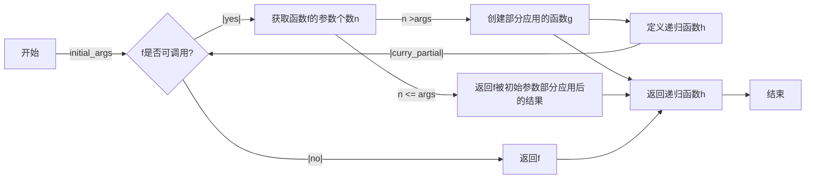

# 实验六 Python函数

班级： 21计科1

学号： B20210301117

姓名： 张靠

Github地址：<git@github.com:zhangkaoaizhongguo/zhangkao.git>

CodeWars地址：<https://www.codewars.com/users/master%20Link>

---

## 实验目的

1. 学习Python函数的基本用法
2. 学习lambda函数和高阶函数的使用
3. 掌握函数式编程的概念和实践

## 实验环境

1. Git
2. Python 3.10
3. VSCode
4. VSCode插件

## 实验内容和步骤

### 第一部分

Python函数

完成教材《Python编程从入门到实践》下列章节的练习：

- 第8章 函数

---

### 第二部分

在[Codewars网站](https://www.codewars.com)注册账号，完成下列Kata挑战：

---

#### 第一题：编码聚会1

难度： 7kyu

你将得到一个字典数组，代表关于首次报名参加你所组织的编码聚会的开发者的数据。
你的任务是返回来自欧洲的JavaScript开发者的数量。
例如，给定以下列表：

```python
lst1 = [
  { 'firstName': 'Noah', 'lastName': 'M.', 'country': 'Switzerland', 'continent': 'Europe', 'age': 19, 'language': 'JavaScript' },
  { 'firstName': 'Maia', 'lastName': 'S.', 'country': 'Tahiti', 'continent': 'Oceania', 'age': 28, 'language': 'JavaScript' },
  { 'firstName': 'Shufen', 'lastName': 'L.', 'country': 'Taiwan', 'continent': 'Asia', 'age': 35, 'language': 'HTML' },
  { 'firstName': 'Sumayah', 'lastName': 'M.', 'country': 'Tajikistan', 'continent': 'Asia', 'age': 30, 'language': 'CSS' }
]
```

你的函数应该返回数字1。
如果，没有来自欧洲的JavaScript开发人员，那么你的函数应该返回0。

注意：
字符串的格式将总是"Europe"和"JavaScript"。
所有的数据将始终是有效的和统一的，如上面的例子。

这个卡塔是Coding Meetup系列的一部分，其中包括一些简短易行的卡塔，这些卡塔是为了让人们掌握高阶函数的使用。在Python中，这些方法包括：`filter`, `map`, `reduce`。当然也可以采用其他方法来解决这些卡塔。

[代码提交地址](https://www.codewars.com/kata/coding-meetup-number-1-higher-order-functions-series-count-the-number-of-javascript-developers-coming-from-europe)

---

#### 第二题： 使用函数进行计算

难度：5kyu

这次我们想用函数来写计算，并得到结果。让我们看一下一些例子：

```python
seven(times(five())) # must return 35
four(plus(nine())) # must return 13
eight(minus(three())) # must return 5
six(divided_by(two())) # must return 3
```

要求：

- 从0（"零"）到9（"九"）的每个数字都必须有一个函数。
- 必须有一个函数用于以下数学运算：加、减、乘、除。
- 每个计算都由一个操作和两个数字组成。
- 最外面的函数代表左边的操作数，最里面的函数代表右边的操作数。
- 除法应该是整数除法。

例如，下面的计算应该返回2，而不是2.666666...。

```python
eight(divided_by(three()))
```

代码提交地址：
<https://www.codewars.com/kata/525f3eda17c7cd9f9e000b39>

---

#### 第三题： 缩短数值的过滤器(Number Shortening Filter)

难度：6kyu

在这个kata中，我们将创建一个函数，它返回另一个缩短长数字的函数。给定一个初始值数组替换给定基数的 X 次方。如果返回函数的输入不是数字字符串，则应将输入本身作为字符串返回。

例子：

```python
filter1 = shorten_number(['','k','m'],1000)
filter1('234324') == '234k'
filter1('98234324') == '98m'
filter1([1,2,3]) == '[1,2,3]'
filter2 = shorten_number(['B','KB','MB','GB'],1024)
filter2('32') == '32B'
filter2('2100') == '2KB';
filter2('pippi') == 'pippi'
```

代码提交地址：
<https://www.codewars.com/kata/56b4af8ac6167012ec00006f>

---

#### 第四题： 编码聚会7

难度： 6kyu

您将获得一个对象序列，表示已注册参加您组织的下一个编程聚会的开发人员的数据。

您的任务是返回一个序列，其中包括最年长的开发人员。如果有多个开发人员年龄相同，则将他们按照在原始输入数组中出现的顺序列出。

例如，给定以下输入数组：

```python
list1 = [
  { 'firstName': 'Gabriel', 'lastName': 'X.', 'country': 'Monaco', 'continent': 'Europe', 'age': 49, 'language': 'PHP' },
  { 'firstName': 'Odval', 'lastName': 'F.', 'country': 'Mongolia', 'continent': 'Asia', 'age': 38, 'language': 'Python' },
  { 'firstName': 'Emilija', 'lastName': 'S.', 'country': 'Lithuania', 'continent': 'Europe', 'age': 19, 'language': 'Python' },
  { 'firstName': 'Sou', 'lastName': 'B.', 'country': 'Japan', 'continent': 'Asia', 'age': 49, 'language': 'PHP' },
]
```

您的程序应该返回如下结果：

```python
[
  { 'firstName': 'Gabriel', 'lastName': 'X.', 'country': 'Monaco', 'continent': 'Europe', 'age': 49, 'language': 'PHP' },
  { 'firstName': 'Sou', 'lastName': 'B.', 'country': 'Japan', 'continent': 'Asia', 'age': 49, 'language': 'PHP' },
]
```

注意：

- 输入的列表永远都包含像示例中一样有效的正确格式的数据，而且永远不会为空。

代码提交地址：
<https://www.codewars.com/kata/582887f7d04efdaae3000090>

---

#### 第五题： Currying versus partial application

难度： 4kyu

[Currying versus partial application](https://2ality.com/2011/09/currying-vs-part-eval.html)是将一个函数转换为具有更小arity(参数更少)的另一个函数的两种方法。虽然它们经常被混淆，但它们的工作方式是不同的。目标是学会区分它们。

Currying

是一种将接受多个参数的函数转换为以每个参数都只接受一个参数的一系列函数链的技术。

Currying接受一个函数：

```python
f：X × Y → R
```

并将其转换为一个函数：

```python
f'：X → (Y → R)
```

我们不再使用两个参数调用f，而是使用第一个参数调用f'。结果是一个函数，然后我们使用第二个参数调用该函数来产生结果。因此，如果非curried f被调用为：

```python
f(3, 5)
```

那么curried f'被调用为：

```python
f'(3)(5)
```

示例
给定以下函数：

```python
def add(x, y, z):
  return x + y + z
```

我们可以以普通方式调用：

```python
add(1, 2, 3) # => 6
```

但我们可以创建一个curried版本的add(a, b, c)函数：

```python
curriedAdd = lambda a: (lambda b: (lambda c: add(a,b,c)))
curriedAdd(1)(2)(3) # => 6
```

Partial application
是将一定数量的参数固定到函数中，从而产生另一个更小arity(参数更少)的函数的过程。

部分应用接受一个函数：

```python
f：X × Y → R
```

和一个固定值x作为第一个参数，以产生一个新的函数

```python
f'：Y → R
```

f'与f执行的操作相同，但只需要填写第二个参数，这就是其arity比f的arity少一个的原因。可以说第一个参数绑定到x。

示例:

```python
partialAdd = lambda a: (lambda *args: add(a,*args))
partialAdd(1)(2, 3) # => 6
```

你的任务是实现一个名为curryPartial()的通用函数，可以进行currying或部分应用。

例如：

```python
curriedAdd = curryPartial(add)
curriedAdd(1)(2)(3) # => 6

partialAdd = curryPartial(add, 1)
partialAdd(2, 3) # => 6
```

我们希望函数保持灵活性。

所有下面这些例子都应该产生相同的结果：

```python
curryPartial(add)(1)(2)(3) # =>6 
curryPartial(add, 1)(2)(3) # =>6 
curryPartial(add, 1)(2, 3) # =>6 
curryPartial(add, 1, 2)(3) # =>6 
curryPartial(add, 1, 2, 3) # =>6 
curryPartial(add)(1, 2, 3) # =>6 
curryPartial(add)(1, 2)(3) # =>6 
curryPartial(add)()(1, 2, 3) # =>6 
curryPartial(add)()(1)()()(2)(3) # =>6 

curryPartial(add)()(1)()()(2)(3, 4, 5, 6) # =>6 
curryPartial(add, 1)(2, 3, 4, 5) # =>6 

curryPartial(curryPartial(curryPartial(add, 1), 2), 3) # =>6
curryPartial(curryPartial(add, 1, 2), 3) # =>6
curryPartial(curryPartial(add, 1), 2, 3) # =>6
curryPartial(curryPartial(add, 1), 2)(3) # =>6
curryPartial(curryPartial(add, 1)(2), 3) # =>6
curryPartial(curryPartial(curryPartial(add, 1)), 2, 3) # =>6
```

代码提交地址：
<https://www.codewars.com/kata/53cf7e37e9876c35a60002c9>

---

### 第三部分

使用Mermaid绘制程序流程图

安装VSCode插件：

- Markdown Preview Mermaid Support
- Mermaid Markdown Syntax Highlighting

使用Markdown语法绘制你的程序绘制程序流程图（至少一个），Markdown代码如下：


显示效果如下：



查看Mermaid流程图语法-->[点击这里](https://mermaid.js.org/syntax/flowchart.html)

使用Markdown编辑器（例如VScode）编写本次实验的实验报告，包括[实验过程与结果](#实验过程与结果)、[实验考查](#实验考查)和[实验总结](#实验总结)，并将其导出为 **PDF格式** 来提交。

## 实验过程与结果

请将实验过程与结果放在这里，包括：

- [第一部分 Python函数](#第一部分)
- [第二部分 Codewars Kata挑战](#第二部分)
- [第三部分 使用Mermaid绘制程序流程图](#第三部分)

注意代码需要使用markdown的代码块格式化，例如Git命令行语句应该使用下面的格式：


显示效果如下：

```bash
git init
git add .
git status
git commit -m "first commit"
```

如果是Python代码，应该使用下面代码块格式，例如：


显示效果如下：

```python
def add_binary(a,b):
    return bin(a+b)[2:]
```

代码运行结果的文本可以直接粘贴在这里。

## 第一部分 Codewars Kata挑战

第一题：编码聚会1(Coding Meetup #1 - Higher-Order Functions Series - Count the number of JavaScript developers coming from Europe)

```python
def count_developers(lst):
    n_d = 0  
    for i in range(len(lst)): 
        if lst[i]['continent'] == 'Europe': 
            if lst[i]['language'] == 'JavaScript':   
                n_d += 1  
    return n_d 
```

第二题：使用函数进行计算(Calculating with Functions)

```python
def zero(operation=None):
    return operation(0) if operation else 0

def one(operation=None):
    return operation(1) if operation else 1

def two(operation=None):
    return operation(2) if operation else 2

def three(operation=None):
    return operation(3) if operation else 3

def four(operation=None):
    return operation(4) if operation else 4

def five(operation=None):
    return operation(5) if operation else 5

def six(operation=None):
    return operation(6) if operation else 6

def seven(operation=None):
    return operation(7) if operation else 7

def eight(operation=None):
    return operation(8) if operation else 8

def nine(operation=None):
    return operation(9) if operation else 9

def plus(y):
    return lambda x: x + y

def minus(y):
    return lambda x: x - y

def times(y):
    return lambda x: x * y

def dividedBy(y):
    return lambda x: x // y

result1 = seven(times(five()))  # 应返回 35
result2 = four(plus(nine()))    # 应返回 13
result3 = eight(minus(three()))  # 应返回 5
result4 = six(dividedBy(two()))  # 应返回 3

print(result1, result2, result3, result4)

```

第三题： 缩短数值的过滤器(Number Shortening Filter)

```python
def shorten_number(suffixes, base):
    def fileter(x):
        index = 0
        try:
            x = int(x)
        except: 
            return str(x)
        while int(x/base) > 0 and index < len(suffixes)-1:
            index = index+1
            x = int(x/base)
        return str(x) + suffixes[index]
    return fileter
```

第四题： 编码聚会7 (Coding Meetup #7 - Higher-Order Functions Series - Find the most senior developer)

```python
def find_senior(lst):    
    mage = max(a['age'] for a in lst)
    return [a for a in lst if a['age']==mage]
```

第五题： Currying versus partial application

```python
from functools import partial, wraps
from inspect import signature

def curry_partial(f, *initial_args):
    "Curries and partially applies the initial arguments to the function"
    if not callable(f):
        return f

    n = len(signature(f).parameters)
    if n <= len(initial_args):
        return f(*initial_args[:n])

    g = partial(f, *initial_args)
    
    @wraps(g)
    def h(*args):
        return curry_partial(g, *args)
    return h

```

## 第二部分 使用Mermaid绘制程序流程图

第一题：编码聚会1(Coding Meetup #1 - Higher-Order Functions Series - Count the number of JavaScript developers coming from Europe)



第二题：使用函数进行计算(Calculating with Functions)



第三题：缩短数值的过滤器(Number Shortening Filter)



第四题：编码聚会7 (Coding Meetup #7 - Higher-Order Functions Series - Find the most senior developer)



第五题：Currying versus partial application



**注意：不要使用截图，Markdown文档转换为Pdf格式后，截图可能会无法显示。**

## 实验考查

请使用自己的语言并使用尽量简短代码示例回答下面的问题，这些问题将在实验检查时用于提问和答辩以及实际的操作。

1. 什么是函数式编程范式？
2. 什么是lambda函数？请举例说明。
3. 什么是高阶函数？常用的高阶函数有哪些？这些高阶函数如何工作？使用简单的代码示例说明。

## 我的回答

1. 函数式编程范式是一种编程范式，它将计算视为数学函数的计算，避免使用可变的数据和状态。函数式编程强调函数的纯粹性和不可变性，并且通常采用一系列数学概念，如高阶函数、递归、lambda演算等。
以下是函数式编程范式的一些主要特点：
  纯函数： 纯函数是指函数的输出完全由输入决定，而且函数执行过程中没有副作用。相同的输入始终产生相同的输出，不依赖外部状态，不改变全局状态。
  不可变性： 函数式编程强调数据的不可变性，即一旦数据被创建，就不能被修改。如果需要对数据进行更改，应该创建一个新的数据副本而不是修改原始数据。
  高阶函数： 函数可以作为参数传递给其他函数，也可以作为返回值。高阶函数是函数式编程的一个关键概念，它使得编程变得更加抽象和灵活。
  递归： 函数式编程通常使用递归而不是循环来进行迭代。递归是一种自我引用的方法，它可以用于解决许多问题，并与函数式编程的不可变性和纯函数性相契合。
  引用透明性： 表示一个表达式可以被它的值替代而不改变程序的行为。这使得程序更容易理解和推理，因为函数调用不依赖于外部状态。
  惰性求值： 只有在需要的时候才计算表达式的值。这有助于提高程序的性能，因为只有在真正需要结果时才进行计算。
  模块化： 函数式编程鼓励将程序分解为小的、可重用的函数，这有助于构建模块化和易于维护的代码。
   函数式编程范式的一些编程语言，以及在一定程度上支持函数式编程的语言，如JavaScript和Python，都在不同程度上应用了这些特点。函数式编程的优点包括代码简洁、易于理解、并行化的便利性等。然而，它也可能需要程序员适应一些与传统命令式编程不同的思维方式。

2. Lambda函数是一种匿名函数，也称为lambda表达式。它是一种在编程中创建小型、临时的、一次性的函数的方式，通常用于需要传递函数作为参数的情况。
在许多编程语言中，lambda函数通常只有一行，用于执行简单的操作。Lambda函数的语法通常包括关键字lambda，参数列表，冒号(:)，以及函数体。下面是一个简单的lambda函数的通用形式：

```python
# 使用lambda定义一个匿名函数，计算两个数的和
add = lambda x, y: x + y

# 调用lambda函数
result = add(3, 5)

# 输出结果
print(result)  # 输出 8

```

在这个例子中，lambda函数接受两个参数 x 和 y，并返回它们的和。lambda函数赋值给变量 add，然后可以像普通函数一样调用。这里，add(3, 5) 返回 8。
ambda函数通常用于函数式编程中的高阶函数，例如在 map、filter、sorted 等函数中作为参数传递。以下是一个使用lambda函数的例子：

```python
# 使用lambda函数将列表中的每个元素平方
numbers = [1, 2, 3, 4, 5]
squared_numbers = list(map(lambda x: x**2, numbers))

# 输出结果
print(squared_numbers)  # 输出 [1, 4, 9, 16, 25]

```

在这个例子中，map 函数将lambda函数应用于列表中的每个元素，将每个元素平方，最终得到 squared_numbers 列表。

3. 高阶函数是指可以接受一个或多个函数作为参数，并/或者返回一个函数作为结果的函数。在函数式编程中，高阶函数是一种强大的工具，它们可以用来抽象通用的模式，使代码更加简洁和灵活。常用的高阶函数包括 map、filter、reduce 等。

```python
from functools import reduce

# 使用reduce函数计算列表中所有元素的累积和
numbers = [1, 2, 3, 4, 5]
sum_result = reduce(lambda x, y: x + y, numbers)
# 输出结果：15

```

```python
# 使用sorted函数对列表进行升序排序
numbers = [3, 1, 4, 1, 5, 9, 2, 6, 5, 3, 5]
sorted_numbers = sorted(numbers)
# 输出结果：[1, 1, 2, 3, 3, 4, 5, 5, 5, 6, 9]

```

这些高阶函数通常通过将函数作为参数传递给它们来工作，或者返回一个函数作为结果。这种方式允许我们更灵活地操作数据，通过传递不同的函数实现不同的逻辑。
使用高阶函数的优点之一是可以将代码编写得更简洁，通过传递函数作为参数，可以提高代码的可读性和复用性。

## 实验总结

在这次实验中，我提供了关于函数式编程的解释，包括函数式编程范式的特点、lambda函数的概念以及高阶函数的介绍。同时，我还强调了函数式编程中纯函数、不可变性等重要概念。与之前提到的总结相比，这里强调了一些不同的方面：
  函数式编程范式的突出：
重点强调了函数式编程范式的核心特点，如纯函数、不可变性等，突显了它与传统命令式编程的区别。
  突出函数式编程的思想：
更强调了函数式编程的思想，包括通过纯函数和不可变性来减少副作用，以及利用高阶函数实现模块化和灵活的代码结构。
  数据结构和算法的强调：
虽然在具体示例中没有涉及复杂的数据结构和算法，但函数式编程通常与一些特定的数据结构（如不可变数据结构）和算法（如尾递归）相关联。
  与传统编程范式的对比：
强调了函数式编程与传统命令式编程的区别，特别是在对待状态和数据的方式上，更加注重不可变性和函数的纯粹性。
  总体而言，这次总结更加突出了函数式编程范式的独特性和思想，以及它与传统编程方式的差异。这样的总结有助于理解函数式编程的核心概念，并对编写更清晰、易于维护的代码有更深层次的认识。