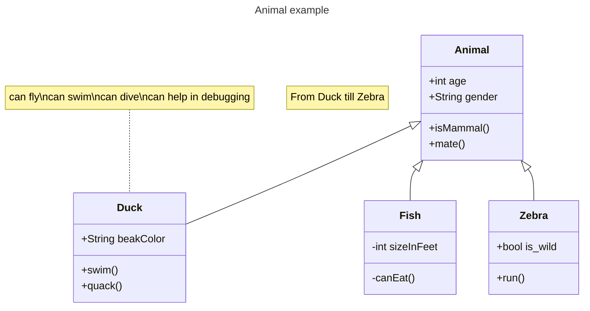
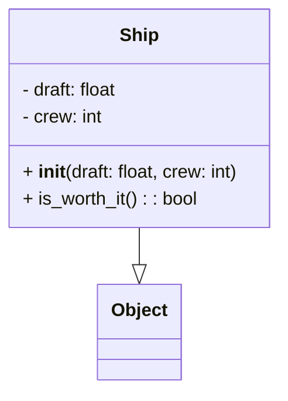
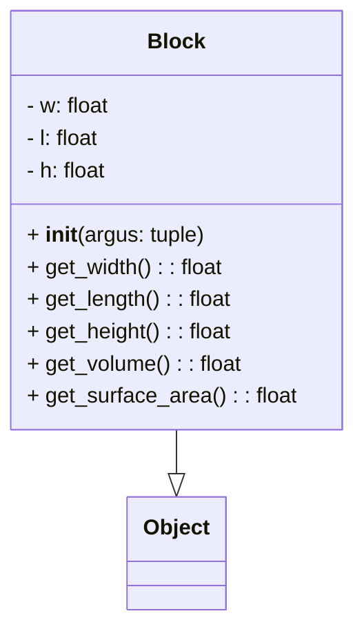
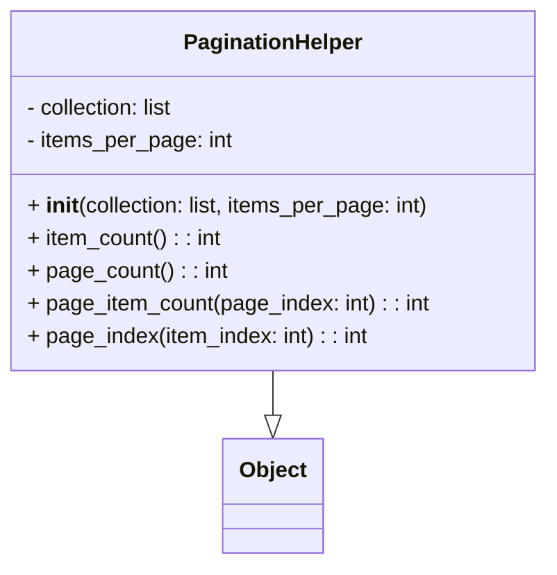
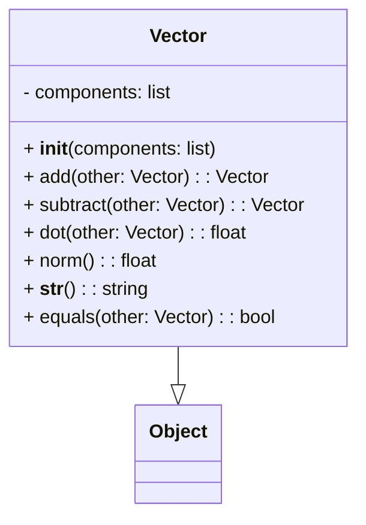

# 实验七 Python面向对象编程

班级： 21计科1

学号： B2021301117

姓名： 张靠

Github地址：<git@github.com:zhangkaoaizhongguo/zhangkao.git>

CodeWars地址：<https://www.codewars.com/users/master%20Link>

---

## 实验目的

1. 学习Python类和继承的基础知识
2. 学习namedtuple和DataClass的使用

## 实验环境

1. Git
2. Python 3.10
3. VSCode
4. VSCode插件

## 实验内容和步骤

### 第一部分

Python面向对象编程

完成教材《Python编程从入门到实践》下列章节的练习：

- 第9章 类

---

### 第二部分

在[Codewars网站](https://www.codewars.com)注册账号，完成下列Kata挑战：

---

#### 第一题：面向对象的海盗

难度： 8kyu

啊哈，伙计!

你是一个小海盗团的首领。而且你有一个计划。在OOP的帮助下，你希望建立一个相当有效的系统来识别船上有大量战利品的船只。
对你来说，不幸的是，现在的人很重，那么你怎么知道一艘船上装的是黄金而不是人呢？

你首先要写一个通用的船舶类。

```python
class Ship:
    def __init__(self, draft, crew):
        self.draft = draft
        self.crew = crew
```

每当你的间谍看到一艘新船进入码头，他们将根据观察结果创建一个新的船舶对象。

- `draft`吃水 - 根据船在水中的高度来估计它的重量
- `crew`船员 - 船上船员的数量

`Titanic = Ship(15, 10)`

任务

你可以访问船舶的 "draft(吃水) "和 "crew(船员)"。"draft(吃水) "是船的总重量，"船员 "是船上的人数。
每个船员都会给船的吃水增加1.5个单位。如果除去船员的重量后，吃水仍然超过20，那么这艘船就值得掠夺。任何有这么重的船一定有很多战利品!
添加方法
`is_worth_it`
来决定这艘船是否值得掠夺。

例如：

```python
Titanic.is_worth_it()
False
```

祝你好运，愿你能找到金子!

代码提交地址：
<https://www.codewars.com/kata/54fe05c4762e2e3047000add>

---

#### 第二题： 搭建积木

难度：7kyu

写一个创建Block的类（Duh.）
构造函数应该接受一个数组作为参数，这个数组将包含3个整数，其形式为`[width, length, height]`，Block应该由这些整数创建。

定义这些方法:

- `get_width()` return the width of the `Block`
- `get_length()` return the length of the `Block`
- `get_height()` return the height of the `Block`
- `get_volume()` return the volume of the `Block`
- `get_surface_area()` return the surface area of the `Block`

例子：

```python
b = Block([2,4,6]) # create a `Block` object with a width of `2` a length of `4` and a height of `6`
b.get_width() # return 2    
b.get_length() # return 4
b.get_height() # return 6
b.get_volume() # return 48
b.get_surface_area() # return 88
```

注意： 不需要检查错误的参数。

代码提交地址：
<https://www.codewars.com/kata/55b75fcf67e558d3750000a3>

---

#### 第三题： 分页助手

难度：5kyu

在这个练习中，你将加强对分页的掌握。你将完成PaginationHelper类，这是一个实用类，有助于查询与数组有关的分页信息。
该类被设计成接收一个值的数组和一个整数，表示每页允许多少个项目。集合/数组中包含的值的类型并不相关。

下面是一些关于如何使用这个类的例子：

```python
helper = PaginationHelper(['a','b','c','d','e','f'], 4)
helper.page_count() # should == 2
helper.item_count() # should == 6
helper.page_item_count(0)  # should == 4
helper.page_item_count(1) # last page - should == 2
helper.page_item_count(2) # should == -1 since the page is invalid

# page_index takes an item index and returns the page that it belongs on
helper.page_index(5) # should == 1 (zero based index)
helper.page_index(2) # should == 0
helper.page_index(20) # should == -1
helper.page_index(-10) # should == -1 because negative indexes are invalid
```

代码提交地址：
<https://www.codewars.com/kata/515bb423de843ea99400000a>

---

#### 第四题： 向量（Vector）类

难度： 5kyu

创建一个支持加法、减法、点积和向量长度的向量（Vector）类。

举例来说：

```python
a = Vector([1, 2, 3])
b = Vector([3, 4, 5])
c = Vector([5, 6, 7, 8])

a.add(b)      # should return a new Vector([4, 6, 8])
a.subtract(b) # should return a new Vector([-2, -2, -2])
a.dot(b)      # should return 1*3 + 2*4 + 3*5 = 26
a.norm()      # should return sqrt(1^2 + 2^2 + 3^2) = sqrt(14)
a.add(c)      # raises an exception
```

如果你试图对两个不同长度的向量进行加减或点缀，你必须抛出一个错误。
向量类还应该提供：

- 一个 `__str__` 方法，这样 `str(a) === '(1,2,3)'` 
- 一个equals方法，用来检查两个具有相同成分的向量是否相等。

注意：测试案例将利用用户提供的equals方法。

代码提交地址：
<https://www.codewars.com/kata/526dad7f8c0eb5c4640000a4>

---

#### 第五题： Codewars风格的等级系统

难度： 4kyu

编写一个名为User的类，用于计算用户在类似于Codewars使用的排名系统中的进步量。

业务规则：

- 一个用户从等级-8开始，可以一直进步到8。
- 没有0（零）等级。在-1之后的下一个等级是1。
- 用户将完成活动。这些活动也有等级。
- 每当用户完成一个有等级的活动，用户的等级进度就会根据活动的等级进行更新。
- 完成活动获得的进度是相对于用户当前的等级与活动的等级而言的。
- 用户的等级进度从零开始，每当进度达到100时，用户的等级就会升级到下一个等级。
- 在上一等级时获得的任何剩余进度都将被应用于下一等级的进度（我们不会丢弃任何进度）。例外的情况是，如果没有其他等级的进展（一旦你达到8级，就没有更多的进展了）。
- 一个用户不能超过8级。
- 唯一可接受的等级值范围是-8,-7,-6,-5,-4,-3,-2,-1,1,2,3,4,5,6,7,8。任何其他的值都应该引起错误。

逻辑案例：

- 如果一个排名为-8的用户完成了一个排名为-7的活动，他们将获得10的进度。
- 如果一个排名为-8的用户完成了排名为-6的活动，他们将获得40的进展。
- 如果一个排名为-8的用户完成了排名为-5的活动，他们将获得90的进展。
- 如果一个排名-8的用户完成了排名-4的活动，他们将获得160个进度，从而使该用户升级到排名-7，并获得60个进度以获得下一个排名。
- 如果一个等级为-1的用户完成了一个等级为1的活动，他们将获得10个进度（记住，零等级会被忽略）。

代码案例：

```python
user = User()
user.rank # => -8
user.progress # => 0
user.inc_progress(-7)
user.progress # => 10
user.inc_progress(-5) # will add 90 progress
user.progress # => 0 # progress is now zero
user.rank # => -7 # rank was upgraded to -7
```

代码提交地址：
<https://www.codewars.com/kata/51fda2d95d6efda45e00004e>

---

### 第三部分

使用Mermaid绘制程序的**类图**

安装VSCode插件：

- Markdown Preview Mermaid Support
- Mermaid Markdown Syntax Highlighting

使用Markdown语法绘制你的程序绘制程序类图（至少一个），Markdown代码如下：


显示效果如下：



查看Mermaid类图的语法-->[点击这里](https://mermaid.js.org/syntax/classDiagram.html)

使用Markdown编辑器（例如VScode）编写本次实验的实验报告，包括[实验过程与结果](#实验过程与结果)、[实验考查](#实验考查)和[实验总结](#实验总结)，并将其导出为 **PDF格式** 来提交。

## 实验过程与结果

请将实验过程与结果放在这里，包括：

- [第一部分 Python面向对象编程](#第一部分)
- [第二部分 Codewars Kata挑战](#第二部分)
- [第三部分 使用Mermaid绘制程序流程图](#第三部分)

注意代码需要使用markdown的代码块格式化，例如Git命令行语句应该使用下面的格式：


显示效果如下：

```bash
git init
git add .
git status
git commit -m "first commit"
```

如果是Python代码，应该使用下面代码块格式，例如：


显示效果如下：

```python
def add_binary(a,b):
    return bin(a+b)[2:]
```

代码运行结果的文本可以直接粘贴在这里。

## 第一部分 Codewars Kata挑战

第一题：面向对象的海盗(OOP: Object Oriented Piracy)

```python
class Ship:
    def __init__(self, draft, crew):
        self.draft = draft
        self.crew = crew
        
    def is_worth_it(self) -> bool:
        crew_weight = self.crew * 1.5
        return self.draft - crew_weight > 20
```

第二题： 建积木(Building blocks)

```python
class Block:
    def __init__(self, argus):
        self.w, self.l, self.h = argus
                
    def get_width(self): return self.w
    
    def get_length(self): return self.l
    
    def get_height(self): return self.h
    
    def get_volume(self): return self.w*self.l*self.h
    
    def get_surface_area(self): return 2*(self.w*self.l+self.l*self.h+self.h*self.w)
    # Good Luck!
```

第三题： 分页助手(PaginationHelper)

```python
import math

class PaginationHelper:
   
    def __init__(self, collection, items_per_page):
        self.collection = collection
        self.items_per_page = items_per_page
         
    def item_count(self):
        return len(self.collection)
    

    def page_count(self):
       
        return math.ceil(self.item_count() / self.items_per_page)

     
    def page_item_count(self, page_index):
        if page_index < 0 or page_index >= self.page_count():
            return -1
        elif page_index == self.page_count() - 1: 
            last_page = self.item_count() % self.items_per_page          
            return self.items_per_page if last_page == 0 else last_page
        else:
            return self.items_per_page

     
    def page_index(self, item_index):
        if item_index < 0 or item_index >= self.item_count():
            return -1
        else:
            return item_index // self.items_per_page
```

第四题： 向量（Vector）类 (Vector class)

```python
import math

class Vector:
    def __init__(self, components):
        self.components = components

    def add(self, other):
        if len(self.components) != len(other.components):
            raise ValueError("向量必须具有相同的长度才能相加。")
        result = [a + b for a, b in zip(self.components, other.components)]
        return Vector(result)

    def subtract(self, other):
        if len(self.components) != len(other.components):
            raise ValueError("向量必须具有相同的长度才能相减。")
        result = [a - b for a, b in zip(self.components, other.components)]
        return Vector(result)

    def dot(self, other):
        if len(self.components) != len(other.components):
            raise ValueError("向量必须具有相同的长度才能进行点积运算。")
        result = sum(a * b for a, b in zip(self.components, other.components))
        return result

    def norm(self):
        result = math.sqrt(sum(a**2 for a in self.components))
        return result

    def __str__(self):
        return "(" + ",".join(map(str, self.components)) + ")"

    def equals(self, other):
        return self.components == other.components

# 示例用法：
a = Vector([1, 2, 3])
b = Vector([3, 4, 5])
c = Vector([5, 6, 7, 8])

print(a.add(b))        # 应返回新的 Vector([4, 6, 8])
print(a.subtract(b))   # 应返回新的 Vector([-2, -2, -2])
print(a.dot(b))        # 应返回 1*3 + 2*4 + 3*5 = 26
print(a.norm())        # 应返回 sqrt(1^2 + 2^2 + 3^2) = sqrt(14)
try:
    print(a.add(c))      # 由于长度不同，应引发异常
except ValueError as e:
    print(e)

# 测试 toString 方法
print(str(a) == '(1,2,3)')  # 应返回 True

# 测试 equals 方法
d = Vector([1, 2, 3])
print(a.equals(d))  # 应返回 True

```

第五题： codewars风格的等级系统(Codewars style ranking system)

```python
class User:
    def __init__(self):
        self.rank = -8
        self.progress = 0

    def inc_progress(self, activity_rank):
        valid_ranks = [-8, -7, -6, -5, -4, -3, -2, -1, 1, 2, 3, 4, 5, 6, 7, 8]

        if activity_rank not in valid_ranks:
            raise ValueError("Invalid rank value")

        rank_difference = activity_rank - self.rank

        if rank_difference == 0:
            self.progress += 3
        elif rank_difference == -1:
            self.progress += 1
        elif rank_difference > 0:
            self.progress += 10 * rank_difference * rank_difference

        while self.progress >= 100:
            if self.rank == -1:
                self.rank += 2
            else:
                self.rank += 1

            self.progress -= 100

        if self.rank == 8:
            self.progress = 0


# 新增的测试用例
def run_tests():
    user = User()

    test_cases = [
        (1, 1, -2),
        (1, 10, 40),
        (1, 13, 80),
        (1, 16, 20),
        (1, 19, 30),
        (1, 22, 40),
        (2, 1, -1),
        (2, 32, 80),
        (-1, 42, 21),
        (3, 82, 61),
    ]

    for rank_change, expected_progress, expected_rank in test_cases:
        user.inc_progress(rank_change)
        assert user.progress == expected_progress
        assert user.rank == expected_rank
        print(f"After applying rank of {rank_change}: {user.progress} should equal {expected_progress}")

run_tests()

```

## 第二部分 使用Mermaid绘制程序类图

第一题：面向对象的海盗(OOP: Object Oriented Piracy)



第二题：建积木(Building blocks)



第三题：分页助手(PaginationHelper)



第四题：向量（Vector）类 (Vector class)



第五题：codewars风格的等级系统(Codewars style ranking system)

```mermaid
flowchart LR


```

**注意：不要使用截图，Markdown文档转换为Pdf格式后，截图可能会无法显示。**

## 实验考查

请使用自己的语言并使用尽量简短代码示例回答下面的问题，这些问题将在实验检查时用于提问和答辩以及实际的操作。

1. Python的类中__init__方法起什么作用？
2. Python语言中如何继承父类和改写（override）父类的方法。
3. Python类有那些特殊的方法？它们的作用是什么？请举三个例子并编写简单的代码说明。


## 我的解答

1. init_方法是Python类中的特殊方法，用于在创建类的实例时进行初始化。它的作用是在对象被创建后，对对象的属性进行一些初始化或设置的操作。_init__方法会在对象创建的时候自动调用，即在使用类创建实例的过程中，该方法会被调用一次。

以下是对 init_方法的详细分析：

触发时机：
__init方法在对象创建后立即调用，即在执行类的构造函数时触发。
它是一个初始化方法，用于设置对象的初始状态。
参数：init方法的第一个参数通常被命名为 self，表示创建的实例对象本身。
除 self 外，可以在 __init_ 方法中定义其他参数，用来接受在创建对象时传递的初始化值。
对象属性初始化：在 _init__方法中，你可以通过 self 来引用对象的属性，并为这些属性赋初值。
这允许你在创建对象时就能够指定对象的一些初始属性值。
调用方式：当你通过类创建对象时，_init_方法会自动调用，你只需要提供除 self 外的参数即可。

```python
class MyClass:
    def __init__(self, param1, param2):
        self.param1 = param1
        self.param2 = param2

obj = MyClass(1, "example")

```

返回值
__init__方法通常不需要显式返回值，它会隐式返回 None。其主要目的是在创建对象时进行一些初始化操作。

```python
class Person:
    def __init__(self, name, age):
        self.name = name
        self.age = age

# 创建 Person 类的实例
person1 = Person("Alice", 25)

# 在创建时，__init__ 方法自动调用，对 person1 的属性进行初始化
print(person1.name)  # 输出: Alice
print(person1.age)   # 输出: 25

```

总的来说，init_方法是一个特殊的方法，用于在对象创建时进行初始化操作，为对象的属性设置初始值。这使得我们在创建对象时能够方便地传递参数，并进行一些预先设定的操作。

2. 在Python中，继承和方法覆盖（override）是面向对象编程的重要概念。继承允许一个类（子类）继承另一个类（父类）的属性和方法。方法覆盖是指子类可以提供与父类中同名的方法，并且在调用时会调用子类中的方法而不是父类中的方法。
3. Python类中有一些特殊的方法，也被称为魔术方法或双下划线方法（dunder methods），它们以双下划线开头和结尾。这些方法对于定制类的行为非常重要，例如构造函数、运算符重载、上下文管理等。以下是其中一些常用的特殊方法：

__str_(self): 字符串表示
作用：定义对象的字符串表示，通常用于print和str函数。
示例：

```python
class Person:
    def __init__(self, name, age):
        self.name = name
        self.age = age

    def __str__(self):
        return f"{self.name}, {self.age} years old"

person = Person("Alice", 25)
print(person)  # 输出: Alice, 25 years old

```

__add_(self, other): 运算符重载 - 加法
作用：定义对象之间的加法操作。
示例：

```python
class Point:
    def __init__(self, x, y):
        self.x = x
        self.y = y

    def __add__(self, other):
        return Point(self.x + other.x, self.y + other.y)

point1 = Point(1, 2)
point2 = Point(3, 4)
result = point1 + point2
print(result.x, result.y)  # 输出: 4 6


```

__init_(self, ...): 构造函数
作用：在对象被创建时初始化对象的属性。
示例：

```python
class Person:
    def __init__(self, name, age):
        self.name = name
        self.age = age

person = Person("Alice", 25)

```

## 实验总结

在这次实验中，我使用了Python编程语言，涉及了以下知识和技能：

面向对象编程： 创建了一个User类，通过对象的属性和方法来模拟用户的等级系统。

异常处理： 使用try-except块处理无效的等级值，通过引发ValueError异常来提醒用户。

逻辑编程： 实现了复杂的等级系统规则和逻辑，包括等级升降、进度计算等。

单元测试： 编写了一组测试用例，通过 assert 语句进行断言，确保程序的功能和逻辑的正确性。

算法设计： 设计了根据用户和活动等级计算进度的算法，以及处理等级升降的逻辑。

迭代和循环： 使用while循环处理连续的等级升降，确保用户在达到100进度时正确升级。

列表和条件语句： 使用列表来存储有效的等级值，并使用if-elif-else语句处理不同的等级差异。

文档和注释： 编写了清晰的注释，说明了代码的不同部分和实现的逻辑。
总体而言，这次实验涵盖了编程语言、面向对象设计、逻辑编程、算法设计等多个方面的知识。通过解决问题和实现功能，我更深入地理解了这些概念，并运用它们来构建一个模拟用户等级系统的程序。
